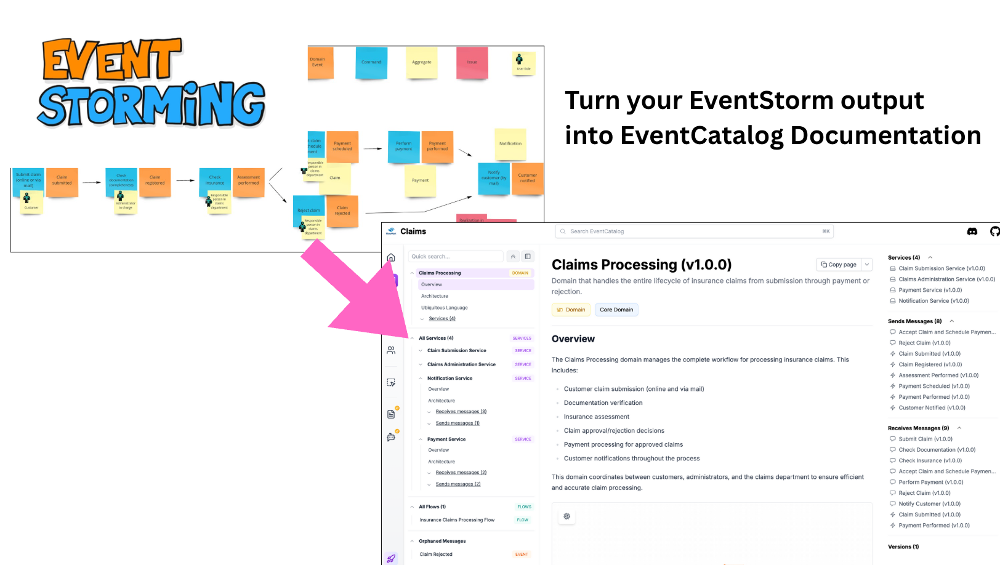

# EventStorm to EventCatalog - MCP Example



Experimental project that will covert your EventStorming output into a documented EventCatalog using the EventCatalog MCP server.

_This is still experimental and a work in progress. You may find small issues when building your catalog._

## What is this?

This project demonstrates how to automatically convert EventStorming output into structured EventCatalog documentation. EventStorming is a collaborative workshop technique for exploring complex business domains, and EventCatalog is a documentation tool for event-driven architectures with a focus on domain-driven design.

## Prerequisites

- [Claude Code](https://www.claude.com/claude-code) installed (or a MCP client that has access to the file system)
- [EventCatalog MCP server](https://www.eventcatalog.dev/docs/development/developer-tools/mcp-server/introduction) installed
- Node.js v20+ installed on your system

## Installation

Install the EventCatalog MCP server for Claude Code:

```bash
claude mcp add --transport stdio eventcatalog -- npx @eventcatalog/mcp-server@latest https://demo.eventcatalog.dev {EVENTCATALOG_SCALE_LICENSE_KEY}
```

You can get a free EventCatalog Scale [license key from the EventCatalog website](https://eventcatalog.cloud).

## Usage

1. Configure the EventCatalog MCP server in your session (using the command above).
1. Take a photo of your Event Storming board or have an Event Storming image ready
2. Open Claude Code and navigate to your project directory
3. Reference your Event Storm image and prompt your LLM to convert the image to an EventCatalog:

```
Turn this photo of an Event Storming board into an EventCatalog.
```

Claude will analyze your Event Storming image and automatically generate:
- Domain definitions
- Service documentation
- Event definitions
- Command definitions
- Flow documentation
- Relationships between components

## Example

This repository includes an example Event Storming session (`storm.jpg`) showing a claims processing workflow with:
- Commands (blue): Submit claim, Check documentation, Check insurance, etc.
- Events (orange): Claim submitted, Claim registered, Payment performed, etc.
- Aggregates (yellow): Claim, Assessment, Payment
- Actors (user icons): Customer, Administrator, Claims department personnel
- Issues (pink): Policy management context questions

The generated EventCatalog documentation is available in the `eventcatalog/` directory.

## EventCatalog Structure

The generated EventCatalog follows this structure:

```
eventcatalog/
   domains/              # Domain definitions and subdomains
   services/            # Service documentation
   events/              # Event definitions
   commands/            # Command definitions
   flows/               # Business flow documentation
   eventcatalog.config.ts  # EventCatalog configuration
```

## Running the Generated EventCatalog

To view your generated EventCatalog:

```bash
cd eventcatalog
npm install
npm run dev
```

Then open your browser to view the interactive documentation at http://localhost:3000.

## Benefits

- **Fast Documentation**: Convert hours of manual documentation into minutes
- **Consistency**: Generated documentation follows EventCatalog standards
- **Collaboration**: Bridge the gap between workshop sessions and technical documentation
- **Iteration**: Quickly update documentation as your Event Storming evolves

## Learn More

- [EventCatalog Documentation](https://www.eventcatalog.dev/)
- [Event Storming Guide](https://en.wikipedia.org/wiki/Event_storming)
- [Claude Code Documentation](https://docs.claude.com/en/docs/claude-code)

## License

This is an example project demonstrating the EventCatalog MCP capabilities.
